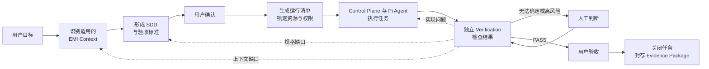
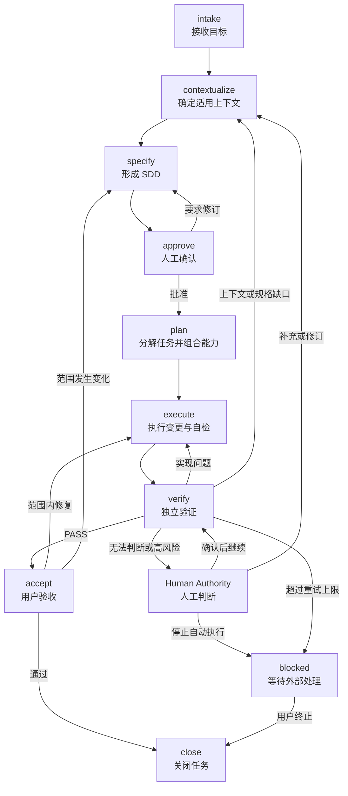
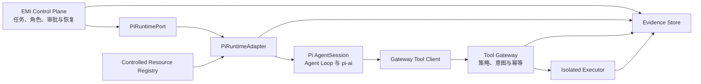

# EMI Harness｜面向欧洲 EMI 的金融级设计到交付智能研发引擎

---

## EMI Harness 是什么

EMI Harness 是面向欧洲 EMI 业务的设计到交付智能研发引擎。它不是单纯的法规知识库，也不是重新开发一套通用 Coding Agent；它以 [Pi Agent Harness](https://github.com/earendil-works/pi-mono) 已成熟的 Agent Runtime 为可替换执行内核，由我们自建 EMI 控制面，将领域知识、研发能力、执行流程、约束规则和验证证据组合成一套可执行、可验证、可追溯的领域研发 Harness。

```text
EMI Harness
= EMI Control Plane
+ Pi Runtime Adapter
+ Controlled EMI Resources
+ Policies & Guardrails
+ Isolated Tool Plane
+ Verification & Evidence
+ Project Integrations
```

| 部件 | 回答的问题 | 主要内容 |
| --- | --- | --- |
| **EMI Control Plane** | 谁按什么顺序执行？ | Coordinator、Executor、Verifier、人工审批，以及持久化任务状态、角色交接、失败回流和恢复。 |
| **Pi Runtime Adapter** | Agent 如何运行？ | 锁定版本的 `pi-ai`、`pi-agent-core` 和 `pi-coding-agent`，以及隔离上游变化的适配接口。 |
| **Controlled EMI Resources** | Agent 应该知道什么，会做什么？ | EMD2、DORA、GDPR、AML/CFT 与制裁框架，EMI 业务和工程规格，以及经过审批的 Skills、Prompts 和任务模板。 |
| **Policies & Guardrails** | 什么不能做，什么必须审批？ | 权限边界、数据分类、职责分离、工具限制、人工门禁和重试上限。 |
| **Isolated Tool Plane** | 有副作用的操作如何安全执行？ | Tool Gateway、权限决策、操作意图、隔离执行环境、幂等处理和结果落账。 |
| **Verification & Evidence** | 如何证明结果正确并恢复、追溯和审计？ | 确定性测试、EMI 场景检查、独立验证、运行状态、规则来源、代码变更、验证报告和验收证据。 |
| **Project Integrations** | 如何接入真实工程？ | Git、CI、知识源、工单系统、审批系统和目标代码仓库。 |

Controlled EMI Resources 不是法规文件和 Skill 的简单集合。进入受控运行的关键知识必须同时记录权威来源、司法辖区、生效版本、适用业务场景、已确认解释、对应工程约束和验证方式，并通过版本和哈希绑定到具体运行。

Pi 提供模型适配、单 Agent 循环、工具调用协议和工作上下文；EMI Harness 负责任务状态、角色分工、受控资源、工具权限、隔离执行、独立验证和证据。两层组合后交付的不只是一段代码，而是一条从目标、依据、规格、实现、验证到验收证据的受控链路。

基于 Pi Runtime 不等于绑定特定模型或部署方式。Pi 只能通过自有适配层使用，上游版本必须精确锁定并通过契约测试；Pi Session 只作为 Agent 工作记录，不代替 EMI 控制面的任务状态和正式证据。完整选型依据见 [ADR 0002](docs/decisions/0002-adopt-pi-runtime-with-emi-control-plane.md)。

## 要解决的问题

欧洲 EMI 牌照展业系统建设需要同时应对 EMD2、DORA、GDPR、AML/CFT 与制裁框架等监管要求，并落实客户资金保护、账务一致性、数据治理、运营韧性、金融犯罪防控和全链路审计等金融级工程约束。当前主要存在以下问题：

- **监管与领域知识高度分散**：相关知识分布在法务、合规、风控、安全、运营和研发团队，并受到司法辖区、业务模式、规则版本和生效时间等条件影响，难以形成统一、准确且持续更新的知识体系。

- **监管义务难以工程化落地**：外部监管要求需要经过适用性判断、内部政策解释和业务控制设计，才能转化为软件规格、架构约束、代码配置和测试标准。这条转换链路依赖大量人工理解，容易出现遗漏、歧义和实现偏差。

- **系统交付依赖少数专家**：需求澄清、方案设计和合规审查高度依赖具备 EMI 业务与金融工程经验的资深人员，导致培养周期长、交付效率低，专家也容易成为多项目并行时的瓶颈。

- **交付质量缺乏稳定性**：不同团队对同一监管要求和业务规则可能产生不同理解，金额、账务、状态、权限、数据处理、韧性和金融犯罪防控等关键控制容易在研发过程中被弱化或遗漏。

- **缺少端到端追溯与交付证据**：监管义务、内部政策、业务控制、系统规格、代码实现、测试结果和运行证据之间缺少稳定的关联，系统即使完成交付，也难以快速证明“满足了什么要求、由什么控制实现、经过了什么验证”。

- **规则变化难以持续传导**：法规、监管解释、内部政策、审计发现和生产事故发生变化后，影响范围难以及时识别，相关规格、代码、测试和控制无法形成一致、受控的更新闭环。

- **通用 AI Agent 无法直接满足 EMI 研发要求**：通用 Agent 缺少经过治理的权威知识、明确的适用边界、金融级工程约束和独立验证机制，可能放大过期规则、错误解释和无证据结论，无法稳定完成 EMI 系统从设计到交付的可靠性、合规性与可审计性要求。

## EMI Harness 如何工作

每项研发任务都从用户目标开始，而不是直接让 Agent 编写代码。Coordinator 先确定业务场景、司法辖区和任务所需的 EMI Context，再形成包含范围、规则、控制要求和验收标准的 SDD。用户确认后，EMI Control Plane 生成本次运行清单，锁定 Pi 版本、角色、资源、工具、策略和目标仓库状态。Pi Runtime Adapter 只使用运行清单允许的上下文和工具执行当前角色的工作。



Policies 与 Guardrails 约束 Agent 可以读取什么、调用什么以及哪些事项必须经过审批；所有有副作用的操作都由 Tool Gateway 在 Agent 进程之外判断权限、记录操作意图并交给隔离环境执行。Verification 使用自动化检查、独立 Agent 审查和必要的人工判断验证结果。State 与 Evidence 在整个过程中持续记录，而不是在结束时补写。验证失败按原因返回上下文、规格或执行阶段；无法判断、高风险事项和超过重试上限的情况进入人工处理或暂停状态。只有验收条件全部满足、用户接受结果且证据链完整，本次交付才算完成。

## 设计原则

- **领域与运行时分离**：Pi 只通过 `PiRuntimePort` 提供通用 Agent Runtime，EMI 控制面、领域资源、策略、验证和证据不依赖 Pi 内部类型。
- **组合优于硬编码**：运行清单为当前任务锁定角色、资源、Skills、Tools 和 Policies，不把业务知识、权限和工作流固化到 Agent Loop 中。
- **上下文必须受控**：只加载来源明确、版本有效且适用于当前司法辖区、业务和任务的知识；规则变化必须经过评审和版本化管理。
- **规格先于执行**：Agent 行动前必须明确范围、规则和验收方式；规格深度按风险确定，未确认的问题必须显式记录，不允许 Agent 自行猜测。
- **最小上下文与最小权限**：每个 Agent 只获得完成当前职责所必需的信息、工具和操作权限，避免上下文污染和权限扩散。
- **安全边界必须在 Agent 之外**：Pi Hook 和 Extension 可以表达运行规则，但不作为权限或隔离证明；有副作用的操作必须经过外部 Tool Gateway 和隔离执行环境。
- **执行与验证分离**：Executor 的实现过程和完成声明不能代替独立验收；Verifier 应使用验收标准和客观证据重新判断结果。
- **确定性检查优先**：能够由测试、CI、权限控制或专用工具判断的规则必须自动检查；语义判断交给独立 Agent，高风险判断交给授权人员。
- **证据定义完成**：代码生成或 Agent 声明不代表交付完成，只有可复现的验证结果、完整的追溯关系和必要的人工确认才能结束任务。
- **高风险判断归人负责**：监管解释、重大架构决策、例外处理和风险接受必须由具备权限的人员确认，Harness 负责提供上下文和证据，不代替责任主体。

## Agent 角色与职责分离

EMI Harness 定义必须被履行的职责，不固定 Agent 数量或协作拓扑。Control Plane 根据任务范围与风险选择需要的 Agent、Skill、Tool 和人工检查，并把经过批准的能力与权限边界写入运行清单；一个职责可以由 Agent 承担，也可以由确定性流程或工具承担，但同一次交付中的执行与验证职责必须保持隔离。

| 职责 | 责任边界 | 实现方式 |
| --- | --- | --- |
| **Coordinator** | 管理目标、SDD、任务、运行状态、角色交接、失败回流和人工升级，不代替 Executor 实现代码或代替用户作出高风险决定。 | Control Plane，按需调用 Coordinator Agent 或确定性逻辑。 |
| **Executor** | 根据已确认的任务和约束完成设计、代码、测试及自检，并提交可供独立验证的结果。 | 执行 Agent，可按任务拆分多个实例。 |
| **Verifier** | 基于 SDD、完整变更和客观证据独立判断 PASS 或 FAIL，不采信 Executor 的完成声明。 | 独立 Agent 与确定性验证工具。 |
| **Human Authority** | 确认监管解释、重大架构决策、例外处理、风险接受和最终验收，对相应决定承担责任。 | 具备授权的业务、合规、风险、架构或交付负责人。 |

Explore、Test、Regulatory Review、Security Review、Architecture Review 和 Data Protection Review 等不是固定角色。它们根据任务需要表现为 Skill、Tool、独立 Agent 或人工检查，由 Control Plane 在运行清单允许的边界内组织。

### 上下文与权限边界

- 每个角色只获得履行当前职责所需的上下文、工具和操作权限。
- 完整运行状态和证据持续保存，提供给角色的模型上下文则根据当前任务和职责按需投影。
- Verifier 从 SDD、代码差异、验证规则和原始证据独立建立判断，不继承 Executor 的推理结论。
- 角色之间通过持久化的任务状态、报告和证据交接，不依赖隐含的共享对话或口头完成声明。

## 任务生命周期与状态机

每项任务都通过一组可持久化、可恢复的状态推进。状态表示已经形成的事实和证据，而不是某个 Agent 的对话阶段。Coordinator Agent 可以提出转换建议，确定性逻辑也可以发起转换，但只有 Control Plane 在校验门禁后能持久化新状态。



| 状态 | 主要责任 | 进入下一状态前必须形成的输出 |
| --- | --- | --- |
| **`intake`** | 用户 / Coordinator | 用户目标、初步范围、期望结果和初始风险等级。 |
| **`contextualize`** | Coordinator，按需调用领域能力 | 适用司法辖区、业务场景、权威来源、规则版本及待确认事项。 |
| **`specify`** | Coordinator | 包含范围、业务规则、技术设计、控制要求和验收标准的 SDD。 |
| **`approve`** | Human Authority | 对范围、高风险事项和验收标准作出的批准、附条件批准或退回结论。 |
| **`plan`** | Coordinator / Control Plane | 可独立验证的任务清单，以及锁定 Pi 版本、角色、资源、Skills、Tools、Policies 和目标仓库状态的运行清单。 |
| **`execute`** | Executor | 代码、配置、测试变更及运行清单要求的自检证据。 |
| **`verify`** | Verifier 与受控验证工具 | 可复现的验证结果、原始证据及独立 PASS 或 FAIL 结论。 |
| **`blocked`** | Coordinator / Human Authority | 阻塞原因、现有证据、恢复条件和恢复后应进入的目标状态。 |
| **`accept`** | 用户 / Human Authority | 最终接受、范围内返工或范围变更结论。 |
| **`close`** | Control Plane / Human Authority | `completed` 或 `cancelled` 结果、完整追溯关系、交付证据和必要的后续事项。 |

### 回流与终止规则

- 实现与自检问题返回 `execute`；上下文、监管解释或 SDD 缺口返回 `contextualize` 或 `specify`，并重新经过必要审批。
- 无法确定的语义判断、高风险决定和例外处理必须升级给 Human Authority，不允许 Agent 通过重试自行形成事实。
- 自动重试达到当前策略规定的上限后进入 `blocked`，保存当前状态、失败证据和恢复条件并停止自动执行。
- `blocked` 是可恢复的暂停状态，不是完成状态。它只能在外部条件满足且 Human Authority 记录恢复依据和目标状态后恢复；用户终止任务时以 `cancelled` 结果进入 `close` 并保留已有证据。
- 用户要求的范围内修复可以返回 `execute`；目标、范围或验收标准变化必须返回 `specify` 并重新批准。
- 每次状态转换都追加记录输入、决定、执行者和证据引用；`close` 只封闭完整证据链，不在结束时补造过程记录。
- `retrospect` 是可选的关闭后活动。它可以提出 Harness 改进建议，但不得自动修改规则、运行配置或 Skills；任何改进都作为独立变更重新进入本生命周期。

## EMI Harness 实现结构

EMI Harness 是拥有自己控制面的应用，Pi 是其中一个可替换的运行时依赖。EMI 代码只依赖 `PiRuntimePort`，`PiRuntimeAdapter` 负责把运行清单转换为 Pi SDK 调用并把 Pi 事件转换为 EMI 内部事件。任务状态、人工审批、权限决策、隔离执行和正式证据不进入 Pi 内核。

### 从定义到实现

“EMI Harness 是什么”中的部件必须能映射到明确的实现位置，避免概念只停留在 README 中。

| 部件 | 主要实现载体 |
| --- | --- |
| **EMI Control Plane** | `control-plane` 负责任务状态机、职责分离、人工审批、失败回流和恢复。 |
| **Pi Runtime Adapter** | `runtime-pi` 实现 `PiRuntimePort`，创建角色独立的 Agent Session，注入受控资源和精确工具白名单，并转换运行事件。 |
| **Controlled EMI Resources** | `resource-registry` 保存经过治理的来源、适用性元数据、领域 Schema、Skills、Prompts 和对应哈希，并提供受控 ResourceLoader。 |
| **Policies & Guardrails** | `control-plane`、`tool-gateway` 和 `assurance` 共同实现权限策略、数据分类、人工门禁、重试限制和 CI 门禁。 |
| **Isolated Tool Plane** | `tool-gateway` 负责工具注册、权限决策、操作意图、幂等键、隔离执行和结果落账。Pi 自定义工具只能调用该边界。 |
| **Verification & Evidence** | `assurance` 实现确定性检查、Verifier 规则、Evidence Schema、证据索引与交付包生成。 |
| **Project Integrations** | `integration` 负责 Git、CI、知识源、工单、审批系统和目标仓库适配。 |

### 控制面与运行时边界



- Control Plane 在调用 Pi 之前先持久化任务和运行状态，不通过模型对话推断当前流程位置。
- Coordinator、Executor 和 Verifier 使用独立 Pi Session，各自只获得当前职责需要的资源和工具。
- `PiRuntimeAdapter` 不使用 Pi 默认的项目资源发现，只注入由运行清单解析出的 ResourceLoader 和工具白名单。
- Pi Extension Hook 可用于运行事件适配和辅助检查，但不是安全边界；工具客户端不直接执行文件、Shell、网络或外部系统副作用。
- Pi Session 可以保存模型上下文和 Agent 工作轨迹，但任务状态、审批、工具操作结果和交付结论以 EMI 自有存储为准。

### 运行清单

每次受控运行都在启动 Agent 前形成不可随运行修改的清单，至少记录 Run ID、任务和角色、Pi 与 Adapter 版本、资源版本与哈希、工具白名单、策略版本、目标仓库与提交、必要的审批引用。运行中需要改变任何已锁定内容时，必须停止当前运行并形成新清单，不允许 Agent 自行扩权或换用未批准资源。

### 目标源代码结构

```text
emi-harness/
├── package.json
├── pnpm-lock.yaml
├── pnpm-workspace.yaml
├── packages/
│   ├── control-plane/     # 任务状态、角色、审批、回流与恢复
│   ├── runtime-pi/        # PiRuntimePort、Pi 适配与契约测试
│   ├── resource-registry/ # EMI Context、Skills、Prompts、Schema 与 ResourceLoader
│   ├── tool-gateway/      # 工具策略、意图、幂等、执行与结果
│   ├── assurance/         # Verifiers、Evidence Schema 与交付检查
│   └── integration/       # Git、CI、知识源、工单和审批适配
├── scripts/              # 受控启动、版本锁定、配置检查与发布脚本
├── tests/                # 跨包契约、失败恢复与端到端测试
├── roadmap/              # 阶段目标和实施进度
├── calibrations/         # 已批准的校准任务及其设计记录
├── docs/                 # 架构、开发和运行文档
├── AGENTS.md              # 仓库级 Agent 导航和贡献边界
└── README.md
```

上图是逐步建设的目标结构。只有开始实现一项真实能力时才创建相应目录；每个包必须有明确的职责、入口、输出、依赖方向和契约测试，不用空包或占位文件制造已经完成的假象。

### 状态、证据与仓库边界

| 位置 | 保存内容 | 不应保存的内容 |
| --- | --- | --- |
| **EMI Harness 源代码仓库** | 控制面、Pi 适配、受治理资源、工具策略、Verifiers、Schema、模板和测试。 | 具体目标项目的完整运行记录、生产凭据或客户数据。 |
| **EMI Control Plane 与 Evidence Store** | 任务状态、运行清单、审批、角色交接、工具操作意图与结果、验证结论和证据索引。 | 明文凭据、不必要的模型推理或未脱敏客户数据。 |
| **Pi Session Storage** | 模型可见输入、Agent 消息、工具调用结果和工作上下文，用于 Agent 工作记录和必要恢复。 | 权威任务状态、风险接受或目标项目的正式交付结论。 |
| **目标项目 Evidence Package** | SDD、Context Manifest、审批、任务计划、代码提交、验证结果、最终验收及对应 Run ID、Session ID 和制品哈希。 | Harness 全局规则的私有副本或不受控的模型推理文本。 |

Pi Session 与 EMI Control Plane 通过 Run ID、Role Run ID、Session ID 和制品哈希关联。Control Plane 中的结构化状态和证据引用是运行事实来源，目标项目 Evidence Package 是可供交付、审计和复现的导出结果，Pi Session 不代替二者。访问控制、脱敏和保留期限由 EMI Control Plane、Tool Gateway 与部署环境共同执行。

## 目标项目的技术栈与结构

EMI Harness 自身的运行技术栈与目标 EMI 应用的技术栈相互独立。Harness Runtime 满足已锁定 Pi 版本的兼容要求；目标项目根据业务形态、风险和现有环境选择技术栈与项目结构，不由 EMI Harness 强制采用同一种语言、框架或模块数量。

### 技术栈分层

| 层次 | v0.1 候选基线 | 选型原则 |
| --- | --- | --- |
| **EMI Harness Runtime** | [Pi Agent Harness](https://github.com/earendil-works/pi-mono)、Node.js 24 LTS、TypeScript、pnpm | 精确锁定经过验证的 Pi 包版本，只通过 `PiRuntimePort` 与适配层使用。 |
| **EMI 领域资产** | Markdown、YAML、JSON Schema、Git | 优先采用可审查、可版本化和可比较的开放格式；检索索引不能代替权威源文件。 |
| **Java 项目默认技术栈** | Java 25 LTS、Spring Boot 4.1.x、Maven 3.9.x 与 Maven Wrapper | 精确版本在具体项目中锁定并通过受控变更升级，不在顶层规则中永久写死补丁版本。 |
| **模块与测试** | Spring Modulith、ArchUnit、JUnit、Testcontainers | 先验证业务模块边界，再根据真实部署需求决定是否拆分物理模块或服务。 |
| **数据与可观测性** | PostgreSQL 18、受控数据库迁移、OpenTelemetry | PostgreSQL 作为事务数据的默认候选；最终选择和数据拓扑由具体 SDD 决定。 |
| **按需基础设施** | Kafka、Redis、搜索引擎及其他中间件 | 只有在 SDD 明确使用场景、失效策略和验收方式后才能引入。 |

### 默认 Java 项目结构：`java-spring-modulith`

新建 Java EMI 应用默认先按业务能力形成模块化单体，而不是按技术层建立固定数量的 Maven 子模块。Account、Ledger、Payment、Safeguarding、Compliance 等是可能的业务模块，实际模块由当前系统的领域边界决定。

```text
{system}/
└── src/main/java/{base-package}/
    ├── {business-capability-a}/
    │   ├── domain/
    │   ├── application/
    │   └── adapter/
    │       ├── in/
    │       └── out/
    ├── {business-capability-b}/
    │   ├── domain/
    │   ├── application/
    │   └── adapter/
    └── Application.java
```

- `domain` 保存业务模型和规则，不依赖应用编排、外部适配器或具体基础设施实现。
- `application` 编排用例并定义所需端口，不直接依赖外部系统实现。
- `adapter/in` 接收 REST、消息或调度等外部输入，`adapter/out` 实现数据库、消息和外部服务接入。
- 业务模块只通过明确公开的契约协作，Spring Modulith 与 ArchUnit 持续验证模块和依赖边界。
- 单元测试和模块集成测试跟随所属业务模块，跨系统验收测试在 SDD 明确需要时单独组织。

只有出现独立发布、独立部署、团队所有权、安全隔离或显著不同的扩缩容需求时，才将业务模块拆成 Maven 模块或独立服务。`client`、`common`、`test` 和 `start` 等技术模块按真实需要创建，不作为固定模板；其中 `common` 不得承载业务概念。

## 当前阶段

本 README 描述 EMI Harness 的目标定位和架构，不表示其中全部能力已经实现。旧版文件式 Harness 已删除，项目当前从 Pi Runtime 适配契约、最小 EMI Control Plane 和外部工具执行边界开始重新建设；只有完成端到端验证的能力才视为可用。阶段目标、实施进度和完成条件以 [`roadmap/README.md`](roadmap/README.md) 为准。
