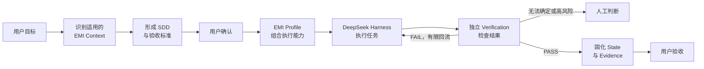
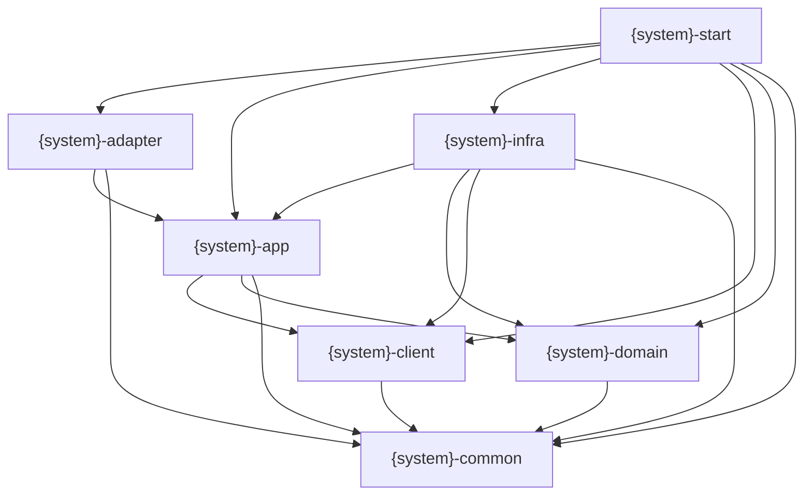
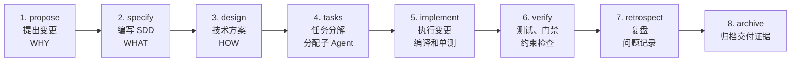
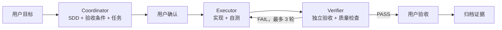

# EMI Harness｜面向欧洲 EMI 的金融级设计到交付智能研发引擎

---

## EMI Harness 是什么

EMI Harness 是面向欧洲 EMI 业务的设计到交付智能研发引擎。它不是单纯的法规知识库，也不是重新开发一套通用 Coding Agent，而是计划以 [DeepSeek Harness](https://github.com/deepseek-ai/deepseek-harness) 作为 Agent 运行底座，将 EMI 领域知识、研发能力、执行流程、约束规则和验证证据组合成一套可执行、可验证、可追溯的领域研发 Harness。

```text
EMI Harness
= DeepSeek Harness Runtime
+ EMI Context
+ Skills & Tools
+ Agent & Workflow
+ Policies & Guardrails
+ Verification
+ State & Evidence
+ Profile & Integrations
```

| 部件 | 回答的问题 | 主要内容 |
|------|------------|----------|
| **DeepSeek Harness Runtime** | Agent 在哪里运行？ | Model Adapter、Agent Loop、Session、Tools、Sandbox、Storage、调度和 UI。 |
| **EMI Context** | Agent 应该知道什么？ | EMD2、DORA、GDPR、AML/CFT、制裁框架及其适用范围，以及 EMI 业务模型、系统规格和工程规范。 |
| **Skills & Tools** | Agent 能执行什么？ | 编写 SDD、领域建模、架构设计、编码、测试、审查、法规检索和证据生成。 |
| **Agent & Workflow** | 谁按什么顺序执行？ | Coordinator、Executor、Verifier，以及任务状态、角色交接、失败回流和人工确认。 |
| **Policies & Guardrails** | 什么不能做，什么必须审批？ | 权限边界、数据分类、职责分离、工具限制、人工门禁和重试上限。 |
| **Verification** | 如何证明结果正确？ | 单元测试、架构测试、EMI 场景测试、合规检查、独立验证和最终验收。 |
| **State & Evidence** | 如何恢复、追溯和审计？ | 运行状态、决策记录、规则来源、代码变更、测试日志、验证报告和验收证据。 |
| **Profile & Integrations** | 如何组合并接入真实工程？ | EMI Profile、Plugin Bundles，以及 Git、CI、知识源、工单系统和目标代码仓库等集成。 |

EMI Context 不是法规文件的简单集合。进入 Harness 的关键知识必须同时记录权威来源、司法辖区、生效版本、适用业务场景、已确认解释、对应工程约束和验证方式，使监管与业务知识能够进入规格、实现、检查和证据链路。

DeepSeek Harness 提供可组合的通用运行能力；EMI Harness 负责欧洲 EMI 领域的研发与合规控制。基于 DeepSeek Harness 不等于绑定 DeepSeek 模型或 API，模型供应商和部署方式仍需根据数据、合规和供应商风险要求独立选择。DeepSeek Harness 目前处于开发者预览阶段，因此 EMI 领域资产应保持清晰边界，避免与特定版本的运行时实现强耦合。

## 要解决的问题

欧洲 EMI 牌照展业系统建设需要同时应对 EMD2、DORA、GDPR、AML/CFT 与制裁框架等监管要求，并落实客户资金保护、账务一致性、数据治理、运营韧性、金融犯罪防控和全链路审计等金融级工程约束。当前主要存在以下问题：

- **监管与领域知识高度分散**：相关知识分布在法务、合规、风控、安全、运营和研发团队，并受到司法辖区、业务模式、规则版本和生效时间等条件影响，难以形成统一、准确且持续更新的知识体系。

- **监管义务难以工程化落地**：外部监管要求需要经过适用性判断、内部政策解释和业务控制设计，才能转化为软件规格、架构约束、代码配置和测试标准。这条转换链路依赖大量人工理解，容易出现遗漏、歧义和实现偏差。

- **系统交付依赖少数专家**：需求澄清、方案设计和合规审查高度依赖具备 EMI 业务与金融工程经验的资深人员，导致培养周期长、交付效率低，专家也容易成为多项目并行时的瓶颈。

- **交付质量缺乏稳定性**：不同团队对同一监管要求和业务规则可能产生不同理解，金额、账务、状态、权限、数据处理、韧性和金融犯罪防控等关键控制容易在研发过程中被弱化或遗漏。

- **缺少端到端追溯与交付证据**：监管义务、内部政策、业务控制、系统规格、代码实现、测试结果和运行证据之间缺少稳定的关联，系统即使完成交付，也难以快速证明“满足了什么要求、由什么控制实现、经过了什么验证”。

- **规则变化难以持续传导**：法规、监管解释、内部政策、审计发现和生产事故发生变化后，影响范围难以及时识别，相关规格、代码、测试和控制无法形成一致、受控的更新闭环。

- **通用 AI Agent 无法直接满足 EMI 研发要求**：通用 Agent 缺少经过治理的权威知识、明确的适用边界、金融级工程约束和独立验证机制，可能放大过期规则、错误解释和无证据结论，无法稳定完成 EMI 系统从设计到交付的可靠性、合规性与可审计性要求。

## EMI Harness 如何工作

每项研发任务都从用户目标开始，而不是直接让 Agent 编写代码。Coordinator 先识别当前业务、司法辖区和任务所需的 EMI Context，形成包含范围、规则和验收标准的 SDD；用户确认后，再由 EMI Profile 组合本次任务需要的 Skills、Agents、Workflow、Policies 和 Tools，并交给 DeepSeek Harness Runtime 执行。



Policies 与 Guardrails 约束 Agent 可以读取什么、调用什么以及哪些事项必须经过审批；Verification 使用自动化检查、独立 Agent 审查和必要的人工判断验证结果。只有验收条件全部满足，且运行状态、决策、代码变更、测试结果和验证报告形成完整证据后，本次交付才算完成。

## 设计原则

- **领域与运行时分离**：DeepSeek Harness 提供通用 Agent Runtime，EMI Context、Skills、Workflow、Policies 和 Verification 保持独立，不绑定特定模型、供应商或运行时版本。
- **组合优于硬编码**：通过 Profile、Plugin、Skill 和 Workflow 为任务组合能力，不把业务知识、工具和执行流程固化到 Agent Loop 中。
- **上下文必须受控**：只加载来源明确、版本有效且适用于当前司法辖区、业务和任务的知识；规则变化必须经过评审和版本化管理。
- **规格先于执行**：Agent 行动前必须明确范围、规则和验收方式；规格深度按风险确定，未确认的问题必须显式记录，不允许 Agent 自行猜测。
- **最小上下文与最小权限**：每个 Agent 只获得完成当前职责所必需的信息、工具和操作权限，避免上下文污染和权限扩散。
- **执行与验证分离**：Executor 的实现过程和完成声明不能代替独立验收；Verifier 应使用验收标准和客观证据重新判断结果。
- **确定性检查优先**：能够由测试、CI、权限控制或专用工具判断的规则必须自动检查；语义判断交给独立 Agent，高风险判断交给授权人员。
- **证据定义完成**：代码生成或 Agent 声明不代表交付完成，只有可复现的验证结果、完整的追溯关系和必要的人工确认才能结束任务。
- **高风险判断归人负责**：监管解释、重大架构决策、例外处理和风险接受必须由具备权限的人员确认，Harness 负责提供上下文和证据，不代替责任主体。

## Agent 角色与职责分离

EMI Harness 定义必须被履行的职责，不固定 Agent 数量或协作拓扑。EMI Profile 根据任务范围和风险组合需要的 Agent、Skill、Tool 与人工检查；一个职责可以由 Agent 承担，也可以由确定性的 Workflow 或工具承担，但同一次交付中的执行与验证职责必须保持隔离。

| 职责 | 责任边界 | 实现方式 |
|------|----------|----------|
| **Coordinator** | 管理目标、SDD、任务、运行状态、角色交接、失败回流和人工升级，不代替 Executor 实现代码或代替用户作出高风险决定。 | Coordinator Agent 或确定性 Workflow。 |
| **Executor** | 根据已确认的任务和约束完成设计、代码、测试及自检，并提交可供独立验证的结果。 | 执行 Agent，可按任务拆分多个实例。 |
| **Verifier** | 基于 SDD、完整变更和客观证据独立判断 PASS 或 FAIL，不采信 Executor 的完成声明。 | 独立 Agent 与确定性验证工具。 |
| **Human Authority** | 确认监管解释、重大架构决策、例外处理、风险接受和最终验收，对相应决定承担责任。 | 具备授权的业务、合规、风险、架构或交付负责人。 |

Explore、Test、Regulatory Review、Security Review、Architecture Review 和 Data Protection Review 等不是固定角色。它们根据任务需要表现为 Skill、Tool、独立 Agent 或人工检查，由 EMI Profile 在运行时组合。

### 上下文与权限边界

- 每个角色只获得履行当前职责所需的上下文、工具和操作权限。
- 完整运行状态和证据持续保存，提供给角色的模型上下文则根据当前任务和职责按需投影。
- Verifier 从 SDD、代码差异、验证规则和原始证据独立建立判断，不继承 Executor 的推理结论。
- 角色之间通过持久化的任务状态、报告和证据交接，不依赖隐含的共享对话或口头完成声明。

## 8 模块架构

EMI Harness 生成或改造的每个业务系统，统一采用 8 模块 Maven 工程结构。`{system}` 表示具体业务系统名称；v0.1 首次试跑使用 Java 17 和 Spring Boot 4.1.0。

| 模块 | 职责 |
|------|------|
| **`{system}-client`** | 对外契约：Facade 接口和 Request/Response DTO，可独立发布给其他系统依赖，不包含实现代码。 |
| **`{system}-adapter`** | 应用入口聚合器，按需提供 REST Controller、MQ Consumer 和 Scheduler。 |
| **`{system}-app`** | 应用编排：Facade 实现、AppService、事务、幂等、Command/Result、转换器以及业务语义 Gateway 接口。 |
| **`{system}-domain`** | 领域模型与领域规则：聚合根、状态机、DomainService、Repository 接口以及领域数据载体。具体承载账户、支付、账务、资金保护等当前系统的业务规则。 |
| **`{system}-infra`** | 基础设施实现：Repository/Gateway 实现、Mapper、PO、数据库、MQ、Redis、ID 生成，以及银行、支付渠道、KYC、AML 和制裁筛查等外部系统接入。 |
| **`{system}-start`** | Spring Boot 启动入口和应用装配。 |
| **`{system}-common`** | 极少量通用基础能力；业务 DTO、Repository、Gateway、枚举和常量不得放入该模块。 |
| **`{system}-test`** | 跨模块集成测试、ArchUnit 架构约束测试，以及 EMI 关键业务与合规场景测试；模块内单元测试仍放在各自模块。 |

### 依赖方向



### 核心约束

- `domain` 不依赖 `infra`，Repository 接口定义在 `domain`，实现在 `infra`。
- `app` 不依赖 `infra`，业务语义 Gateway 接口定义在 `app`，实现在 `infra`。
- `adapter` 只通过 `app` 访问业务能力，不直接访问 `domain` 或 `infra`。
- `client` 只保存对外契约，不包含业务实现。
- `common` 保持最小化，不能成为跨层依赖的业务代码堆放区。

## 核心工作流



| 步骤 | 执行者 | 输入 | 输出 |
|------|--------|------|------|
| **propose** | 用户 / Coordinator | 业务需求、监管要求、内部政策、审计发现或生产问题 | 说明变更原因、目标和初步范围的变更提案 |
| **specify** | Coordinator | 变更提案 + 规格模板 | 明确范围、业务规则、适用约束和验收标准的 SDD |
| **design** | Coordinator | 已确认的 SDD | 写入 SDD 的领域模型、接口、数据、异常处理和技术方案 |
| **tasks** | Coordinator | SDD + 技术方案 | 范围明确、可独立验证的任务清单及子 Agent 分工 |
| **implement** | Executor Agent | 单个变更任务 + 对应约束 | 代码变更、编译结果和相关单元测试结果 |
| **verify** | Verifier Agent + Test Agent | 全量变更 + SDD 验收标准 + 约束规则 | `mvn verify`、架构与反模式检查、EMI 场景测试及验证报告 |
| **retrospect** | Coordinator，用户确认 | 执行日志 + 验证报告 | 规格、规则、测试和执行过程的复盘报告及问题记录 |
| **archive** | Coordinator | SDD + 任务记录 + 交付证据 + 复盘报告 | 归档到业务项目的完整交付记录 |

### 关键门禁

| 门禁 | 阶段 | 未通过处理 |
|------|------|-----------|
| 需求与验收标准确认 | specify / design | 未确认的问题记录在 SDD 中，不进入实现 |
| `mvn compile` + 相关单元测试 | 每个 implement 任务完成后 | 返回 Executor 修复并重新执行 |
| `mvn verify` | verify | 修复后重新验证；超过重试次数则升级给人 |
| 架构、反模式和关键约束检查 | verify | 必须消除本次变更新增的 MUST 违规 |
| EMI 业务与合规场景测试 | verify | 修复实现或补充规格后重新验证 |
| 最终交付确认 | archive 前 | 所有要求的检查和人工审查通过后才能归档交付 |

交付证据保存在对应业务项目中。复盘只记录本次执行中发现的问题，不自动生成或应用 Harness 改进；确需调整 Harness 时，作为普通变更单独提出并经过人工评审。

## 框架结构

第一阶段只建设一个可运行的最小闭环：支持一个 `new-module` 任务，由 Coordinator、Executor 和 Verifier 三个角色完成规划、执行、独立验证与失败回流。目录中的每个文件都必须被该闭环实际读取或生成；未进入首次运行链路的能力不提前建设。

### 最小运行闭环



- **Coordinator** 只管理目标、SDD、任务、运行状态和角色交接，不直接实现业务代码。
- **Executor** 只获取当前任务、相关 SDD 和必要 Guardrail，完成代码与自测。
- **Verifier** 使用全新上下文，基于 SDD 验收条件和客观命令独立判定，不依赖 Executor 的实现思路或完成声明。
- 验证失败时，Verifier 必须输出失败项、证据和复现方式；Coordinator 将该报告交回 Executor。
- 连续三轮仍未达到验收条件时停止自动执行，记录当前状态并升级给用户。

### 最小目录树

```text
emi-harness/
├── README.md
├── AGENTS.md                       # Agent 导航入口和按需加载地图
├── install.sh                      # 记录 Harness 路径并安装 Skill
│
├── roadmap/
│   └── README.md                    # 阶段目标、实施计划和当前进度
│
├── specs/
│   └── pilot/
│       └── system-design.md          # 首次试跑的 SDD 与验收条件
│
├── conventions/
│   ├── tech-stack.md                 # 首次试跑使用的已确认技术栈
│   └── module-structure.md           # 8 模块职责与依赖方向
│
├── harness/
│   ├── guardrails/
│   │   ├── core-must-rules.md        # 首个闭环必须遵守的最小规则集
│   │   ├── architecture.md           # 8 模块架构约束
│   │   ├── domain-modeling.md        # Money 和领域对象约束
│   │   └── code-style.md             # 首次试跑需要的代码规范
│   ├── feedback/
│   │   ├── code-quality.md           # 唯一验证命令、通过标准和失败处理
│   │   ├── maven/                    # Maven 质量插件配置
│   │   ├── checkstyle/               # 最小 Checkstyle 规则
│   │   └── archunit/                 # 8 模块依赖测试模板
│   ├── tools/
│   │   └── agent-tools.md            # 创建 SDD、生成骨架、执行验证和记录证据
│   ├── workflow/
│   │   └── new-module.md             # 首个闭环的单一工作流
│   └── observability/
│       └── execution-tracing.md       # run-id、阶段、轮次、交接和结果记录
│
├── templates/
│   ├── sdd-template.md                # 最小 SDD 模板
│   └── task-breakdown-template.md     # 任务、验收条件和进度模板
│
├── scaffolds/
│   └── module-structure.md            # 可编译的 8 模块 Maven 骨架
│
├── skills/
│   └── emi-harness/
│       ├── SKILL.md                   # 读取路径并启动 new-module Workflow
│       └── agents/
│           └── openai.yaml            # Codex Skill 展示与默认触发信息
│
└── reports/
    └── index.md                       # 首次及后续执行的全局索引
```

### 运行状态与证据

Agent 的完成声明不作为运行状态。Coordinator 必须将状态、交接和原始验证证据写入目标项目，使任务可以在新上下文中继续执行。

```text
{target-project}/reports/runs/{run-id}/
├── manifest.md                       # 目标、当前阶段、尝试轮次、交接和最终状态
├── task-breakdown.md                 # 当前任务、验收条件和完成证据
├── acceptance.md                     # 最终验收清单和用户结论
├── retrospective.md                  # 首次运行暴露的真实缺口
├── quality/
│   ├── environment-preflight.log     # Java、Maven 和依赖解析预检
│   ├── preflight-pom.xml             # 验证 Spring Boot Parent 可公开解析
│   └── effective-pom.xml             # 首次运行实际生效的 Maven 版本
└── attempts/
    └── 01/
        ├── executor-report.md         # 本轮变更摘要、自测和交接 commit
        ├── verifier-report.md         # 本轮独立 PASS/FAIL 结论与复现方式
        └── quality/
            └── verify.log             # 本轮原始验证命令输出
```

### TDD

首个目标是创建一个最小 8 模块 Java 17 Maven 工程，并实现不可变 `Money` 值对象及单元测试。本次运行只有在以下条件全部满足时才能完成：

- 8 个 Maven 模块可由根工程统一编译。
- `Money` 的不可变性、同币种运算和异币种拒绝具有单元测试。
- `mvn verify` 返回成功，Checkstyle 和 ArchUnit 检查通过。
- `manifest.md`、Verifier 报告和原始验证日志完整，且可以相互追溯。
- 用户完成最终验收。

在这个闭环实际跑通前，不增加 `new-feature`、`refactor`、分层 Skill、监管知识目录、PRD 生成、外部接入或 Harness 自我进化机制。首次运行暴露的真实缺口，作为后续目录和能力扩展的依据。
