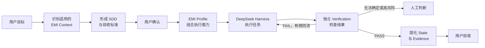
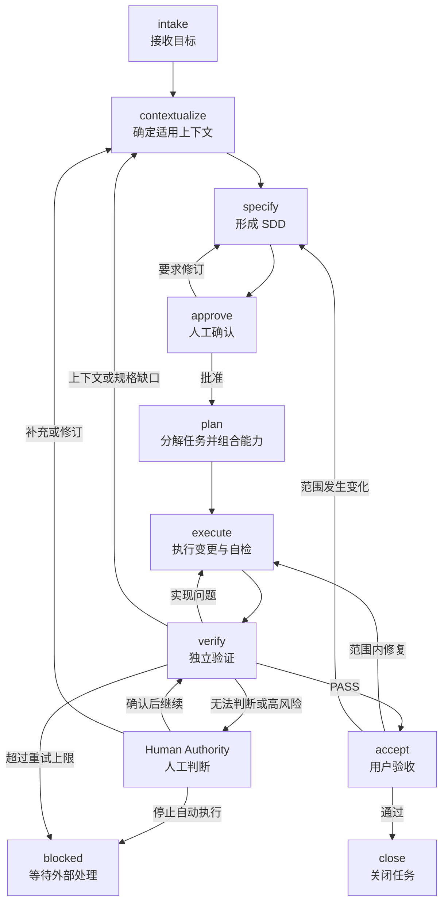

# EMI Harness｜面向欧洲 EMI 的金融级设计到交付智能研发引擎

---

## EMI Harness 是什么

EMI Harness 是面向欧洲 EMI 业务的设计到交付智能研发引擎。它不是单纯的法规知识库，也不是重新开发一套通用 Coding Agent，而是计划以 [DeepSeek Harness](https://github.com/deepseek-ai/deepseek-harness) 作为 Agent 运行底座，将 EMI 领域知识、研发能力、执行流程、约束规则和验证证据组合成一套可执行、可验证、可追溯的领域研发 Harness。

```text
EMI Harness
= DeepSeek Harness Runtime
+ EMI Context
+ Skills & Tools
+ Agent & Workflow
+ Policies & Guardrails
+ Verification
+ State & Evidence
+ Profile & Integrations
```

| 部件 | 回答的问题 | 主要内容 |
|------|------------|----------|
| **DeepSeek Harness Runtime** | Agent 在哪里运行？ | Model Adapter、Agent Loop、Session、Tools、Sandbox、Storage、调度和 UI。 |
| **EMI Context** | Agent 应该知道什么？ | EMD2、DORA、GDPR、AML/CFT、制裁框架及其适用范围，以及 EMI 业务模型、系统规格和工程规范。 |
| **Skills & Tools** | Agent 能执行什么？ | 编写 SDD、领域建模、架构设计、编码、测试、审查、法规检索和证据生成。 |
| **Agent & Workflow** | 谁按什么顺序执行？ | Coordinator、Executor、Verifier，以及任务状态、角色交接、失败回流和人工确认。 |
| **Policies & Guardrails** | 什么不能做，什么必须审批？ | 权限边界、数据分类、职责分离、工具限制、人工门禁和重试上限。 |
| **Verification** | 如何证明结果正确？ | 单元测试、架构测试、EMI 场景测试、合规检查、独立验证和最终验收。 |
| **State & Evidence** | 如何恢复、追溯和审计？ | 运行状态、决策记录、规则来源、代码变更、测试日志、验证报告和验收证据。 |
| **Profile & Integrations** | 如何组合并接入真实工程？ | EMI Profile、Plugin Bundles，以及 Git、CI、知识源、工单系统和目标代码仓库等集成。 |

EMI Context 不是法规文件的简单集合。进入 Harness 的关键知识必须同时记录权威来源、司法辖区、生效版本、适用业务场景、已确认解释、对应工程约束和验证方式，使监管与业务知识能够进入规格、实现、检查和证据链路。

DeepSeek Harness 提供可组合的通用运行能力；EMI Harness 负责欧洲 EMI 领域的研发与合规控制。基于 DeepSeek Harness 不等于绑定 DeepSeek 模型或 API，模型供应商和部署方式仍需根据数据、合规和供应商风险要求独立选择。DeepSeek Harness 目前处于开发者预览阶段，因此 EMI 领域资产应保持清晰边界，避免与特定版本的运行时实现强耦合。

## 要解决的问题

欧洲 EMI 牌照展业系统建设需要同时应对 EMD2、DORA、GDPR、AML/CFT 与制裁框架等监管要求，并落实客户资金保护、账务一致性、数据治理、运营韧性、金融犯罪防控和全链路审计等金融级工程约束。当前主要存在以下问题：

- **监管与领域知识高度分散**：相关知识分布在法务、合规、风控、安全、运营和研发团队，并受到司法辖区、业务模式、规则版本和生效时间等条件影响，难以形成统一、准确且持续更新的知识体系。

- **监管义务难以工程化落地**：外部监管要求需要经过适用性判断、内部政策解释和业务控制设计，才能转化为软件规格、架构约束、代码配置和测试标准。这条转换链路依赖大量人工理解，容易出现遗漏、歧义和实现偏差。

- **系统交付依赖少数专家**：需求澄清、方案设计和合规审查高度依赖具备 EMI 业务与金融工程经验的资深人员，导致培养周期长、交付效率低，专家也容易成为多项目并行时的瓶颈。

- **交付质量缺乏稳定性**：不同团队对同一监管要求和业务规则可能产生不同理解，金额、账务、状态、权限、数据处理、韧性和金融犯罪防控等关键控制容易在研发过程中被弱化或遗漏。

- **缺少端到端追溯与交付证据**：监管义务、内部政策、业务控制、系统规格、代码实现、测试结果和运行证据之间缺少稳定的关联，系统即使完成交付，也难以快速证明“满足了什么要求、由什么控制实现、经过了什么验证”。

- **规则变化难以持续传导**：法规、监管解释、内部政策、审计发现和生产事故发生变化后，影响范围难以及时识别，相关规格、代码、测试和控制无法形成一致、受控的更新闭环。

- **通用 AI Agent 无法直接满足 EMI 研发要求**：通用 Agent 缺少经过治理的权威知识、明确的适用边界、金融级工程约束和独立验证机制，可能放大过期规则、错误解释和无证据结论，无法稳定完成 EMI 系统从设计到交付的可靠性、合规性与可审计性要求。

## EMI Harness 如何工作

每项研发任务都从用户目标开始，而不是直接让 Agent 编写代码。Coordinator 先识别当前业务、司法辖区和任务所需的 EMI Context，形成包含范围、规则和验收标准的 SDD；用户确认后，再由 EMI Profile 组合本次任务需要的 Skills、Agents、Workflow、Policies 和 Tools，并交给 DeepSeek Harness Runtime 执行。



Policies 与 Guardrails 约束 Agent 可以读取什么、调用什么以及哪些事项必须经过审批；Verification 使用自动化检查、独立 Agent 审查和必要的人工判断验证结果。只有验收条件全部满足，且运行状态、决策、代码变更、测试结果和验证报告形成完整证据后，本次交付才算完成。

## 设计原则

- **领域与运行时分离**：DeepSeek Harness 提供通用 Agent Runtime，EMI Context、Skills、Workflow、Policies 和 Verification 保持独立，不绑定特定模型、供应商或运行时版本。
- **组合优于硬编码**：通过 Profile、Plugin、Skill 和 Workflow 为任务组合能力，不把业务知识、工具和执行流程固化到 Agent Loop 中。
- **上下文必须受控**：只加载来源明确、版本有效且适用于当前司法辖区、业务和任务的知识；规则变化必须经过评审和版本化管理。
- **规格先于执行**：Agent 行动前必须明确范围、规则和验收方式；规格深度按风险确定，未确认的问题必须显式记录，不允许 Agent 自行猜测。
- **最小上下文与最小权限**：每个 Agent 只获得完成当前职责所必需的信息、工具和操作权限，避免上下文污染和权限扩散。
- **执行与验证分离**：Executor 的实现过程和完成声明不能代替独立验收；Verifier 应使用验收标准和客观证据重新判断结果。
- **确定性检查优先**：能够由测试、CI、权限控制或专用工具判断的规则必须自动检查；语义判断交给独立 Agent，高风险判断交给授权人员。
- **证据定义完成**：代码生成或 Agent 声明不代表交付完成，只有可复现的验证结果、完整的追溯关系和必要的人工确认才能结束任务。
- **高风险判断归人负责**：监管解释、重大架构决策、例外处理和风险接受必须由具备权限的人员确认，Harness 负责提供上下文和证据，不代替责任主体。

## Agent 角色与职责分离

EMI Harness 定义必须被履行的职责，不固定 Agent 数量或协作拓扑。EMI Profile 根据任务范围和风险组合需要的 Agent、Skill、Tool 与人工检查；一个职责可以由 Agent 承担，也可以由确定性的 Workflow 或工具承担，但同一次交付中的执行与验证职责必须保持隔离。

| 职责 | 责任边界 | 实现方式 |
|------|----------|----------|
| **Coordinator** | 管理目标、SDD、任务、运行状态、角色交接、失败回流和人工升级，不代替 Executor 实现代码或代替用户作出高风险决定。 | Coordinator Agent 或确定性 Workflow。 |
| **Executor** | 根据已确认的任务和约束完成设计、代码、测试及自检，并提交可供独立验证的结果。 | 执行 Agent，可按任务拆分多个实例。 |
| **Verifier** | 基于 SDD、完整变更和客观证据独立判断 PASS 或 FAIL，不采信 Executor 的完成声明。 | 独立 Agent 与确定性验证工具。 |
| **Human Authority** | 确认监管解释、重大架构决策、例外处理、风险接受和最终验收，对相应决定承担责任。 | 具备授权的业务、合规、风险、架构或交付负责人。 |

Explore、Test、Regulatory Review、Security Review、Architecture Review 和 Data Protection Review 等不是固定角色。它们根据任务需要表现为 Skill、Tool、独立 Agent 或人工检查，由 EMI Profile 在运行时组合。

### 上下文与权限边界

- 每个角色只获得履行当前职责所需的上下文、工具和操作权限。
- 完整运行状态和证据持续保存，提供给角色的模型上下文则根据当前任务和职责按需投影。
- Verifier 从 SDD、代码差异、验证规则和原始证据独立建立判断，不继承 Executor 的推理结论。
- 角色之间通过持久化的任务状态、报告和证据交接，不依赖隐含的共享对话或口头完成声明。

## 技术栈与应用架构 Profile

EMI Harness 自身的运行技术栈与目标 EMI 应用的技术栈相互独立。Harness Runtime 跟随 DeepSeek Harness 的兼容要求；目标应用根据业务形态、风险和现有环境选择版本化 Profile，不由 EMI Harness 强制采用同一种语言、框架或模块数量。

### 技术栈分层

| 层次 | 建议基线 | 选型原则 |
|------|----------|----------|
| **EMI Harness Runtime** | [DeepSeek Harness](https://github.com/deepseek-ai/deepseek-harness)、Node.js 24 LTS、TypeScript、pnpm | 与上游兼容要求保持一致，并锁定经过验证的 DeepSeek Harness 版本。 |
| **EMI 领域资产** | Markdown、YAML、JSON Schema、Git | 优先采用可审查、可版本化和可比较的开放格式；检索索引不能代替权威源文件。 |
| **Java 应用默认 Profile** | Java 25 LTS、Spring Boot 4.1.x、Maven 3.9.x 与 Maven Wrapper | 精确版本由 Profile 锁定并通过受控变更升级，不在顶层规则中永久写死补丁版本。 |
| **模块与测试** | Spring Modulith、ArchUnit、JUnit、Testcontainers | 先验证业务模块边界，再根据真实部署需求决定是否拆分物理模块或服务。 |
| **数据与可观测性** | PostgreSQL 18、受控数据库迁移、OpenTelemetry | PostgreSQL 作为事务数据的默认候选；最终选择和数据拓扑由具体 SDD 决定。 |
| **按需基础设施** | Kafka、Redis、搜索引擎及其他中间件 | 只有在 SDD 明确使用场景、失效策略和验收方式后才能引入。 |

### 默认 Profile：`java-spring-modulith`

新建 Java EMI 应用默认先按业务能力形成模块化单体，而不是按技术层建立固定数量的 Maven 子模块。Account、Ledger、Payment、Safeguarding、Compliance 等是可能的业务模块，实际模块由当前系统的领域边界决定。

```text
{system}/
└── src/main/java/{base-package}/
    ├── {business-capability-a}/
    │   ├── domain/
    │   ├── application/
    │   └── adapter/
    │       ├── in/
    │       └── out/
    ├── {business-capability-b}/
    │   ├── domain/
    │   ├── application/
    │   └── adapter/
    └── Application.java
```

- `domain` 保存业务模型和规则，不依赖应用编排、外部适配器或具体基础设施实现。
- `application` 编排用例并定义所需端口，不直接依赖外部系统实现。
- `adapter/in` 接收 REST、消息或调度等外部输入，`adapter/out` 实现数据库、消息和外部服务接入。
- 业务模块只通过明确公开的契约协作，Spring Modulith 与 ArchUnit 持续验证模块和依赖边界。
- 单元测试和模块集成测试跟随所属业务模块，跨系统验收测试在 SDD 明确需要时单独组织。

只有出现独立发布、独立部署、团队所有权、安全隔离或显著不同的扩缩容需求时，才将业务模块拆成 Maven 模块或独立服务。`client`、`common`、`test` 和 `start` 等技术模块按真实需要创建，不作为固定模板；其中 `common` 不得承载业务概念。

原 8 模块 Maven 结构继续作为 `emi-pilot` 已批准的 v0.1 校准契约，不追溯修改；后续如证明仍有适用场景，可沉淀为可选的 `java-layered-multi-module` Profile，但不再代表 EMI Harness 的默认应用架构。

## 任务生命周期与状态机

每项任务都通过一组可持久化、可恢复的状态推进。状态表示已经形成的事实和证据，而不是某个 Agent 的对话阶段；Coordinator Agent 或确定性 Workflow 均可驱动状态转换，但不能绕过进入下一状态所需的门禁。



| 状态 | 主要责任 | 进入下一状态前必须形成的输出 |
|------|----------|------------------------------|
| **`intake`** | 用户 / Coordinator | 用户目标、初步范围、期望结果和初始风险等级。 |
| **`contextualize`** | Coordinator，按需调用领域能力 | 适用司法辖区、业务场景、权威来源、规则版本及待确认事项。 |
| **`specify`** | Coordinator | 包含范围、业务规则、技术设计、控制要求和验收标准的 SDD。 |
| **`approve`** | Human Authority | 对范围、高风险事项和验收标准作出的批准、附条件批准或退回结论。 |
| **`plan`** | Coordinator / Workflow | 可独立验证的任务清单，以及本次运行选用的 Profile、Skills、Tools、Policies 和职责分配。 |
| **`execute`** | Executor | 代码、配置、测试变更及 Profile 要求的自检证据。 |
| **`verify`** | Verifier 与 Profile 定义的验证工具 | 可复现的验证结果、原始证据及独立 PASS 或 FAIL 结论。 |
| **`accept`** | 用户 / Human Authority | 最终接受、范围内返工或范围变更结论。 |
| **`close`** | Coordinator / Workflow | 最终状态、完整追溯关系、交付证据和必要的后续事项。 |

### 回流与终止规则

- 实现与自检问题返回 `execute`；上下文、监管解释或 SDD 缺口返回 `contextualize` 或 `specify`，并重新经过必要审批。
- 无法确定的语义判断、高风险决定和例外处理必须升级给 Human Authority，不允许 Agent 通过重试自行形成事实。
- 自动重试达到 Profile 规定的上限后进入 `blocked`，保存当前状态、失败证据和恢复条件并停止自动执行。
- `blocked` 只能在外部条件满足且 Human Authority 记录恢复依据和目标状态后恢复；用户终止任务时必须以明确的终止状态关闭并保留已有证据。
- 用户要求的范围内修复可以返回 `execute`；目标、范围或验收标准变化必须返回 `specify` 并重新批准。
- 每次状态转换都追加记录输入、决定、执行者和证据引用；`close` 只封闭完整证据链，不在结束时补造过程记录。
- `retrospect` 是可选的关闭后活动。它可以提出 Harness 改进建议，但不得自动修改规则、Profile 或 Skills；任何改进都作为独立变更重新进入本生命周期。

## EMI Harness 实现结构

EMI Harness 源代码仓库负责开发和发布 Bundle、Plugin 与受治理的领域资产；可启动的 EMI Profile 安装在 `$DSH_HOME/profiles/<name>`，由 DeepSeek Harness 负责加载。Profile 回答“本次运行组合哪些 Bundle”，Bundle 回答“向运行时贡献哪些插件与配置”，两者不混为同一种包，并遵循 DeepSeek Harness 的[插件打包与安装约定](https://github.com/deepseek-ai/deepseek-harness/blob/master/docs/user/develop/basic/publish.zh.md)。

### Profile 与 Bundle 组合

```text
$DSH_HOME/profiles/emi/
├── package.json          # dsh.profile：按顺序声明 Bundles
├── cordis.patch.yml      # 部署或用户级覆盖层
├── pnpm-workspace.yaml   # Profile 的依赖安装策略
└── node_modules/         # 已锁定版本的树外 Bundles 与 Plugins

dsh.profile.bundles
├── @deepseek-ai/dsh-base
├── EMI Domain Bundle
├── EMI Delivery Bundle
├── EMI Integration Bundle
└── EMI Assurance Bundle
```

| Bundle | 主要职责 |
|--------|----------|
| **EMI Domain Bundle** | 提供监管与业务 Context、适用性元数据、领域 Schema 和受控知识加载能力。 |
| **EMI Delivery Bundle** | 提供 Skills、Workflows、Agent Presets、SDD 与任务模板，以及任务生命周期的执行能力。 |
| **EMI Integration Bundle** | 提供 Git、CI、目标仓库、知识源、工单和审批系统等适配能力。 |
| **EMI Assurance Bundle** | 提供 Policies、Guardrails、Verifiers、Evidence Schema 和人工门禁，并在 EMI Bundles 中最后应用。 |

Bundle 是带有 `dsh.bundle` manifest 和 `cordis.patch.yml` 的可分发 npm 包，可以同时携带自身所需的插件与领域资产。只有需要独立复用、版本管理或替换的能力才拆成单独 Plugin 包，避免把目录数量当成架构质量。

受控运行必须锁定 DeepSeek Harness、Bundles 和 Plugins 的精确版本，限制未经评审的 Profile 或 Home 级覆盖，并保存 `dsh --profile emi --dump-config` 生成的有效配置及其完整性信息。配置可覆盖不等于可以绕过 EMI Policy。

### 目标源代码结构

```text
emi-harness/
├── package.json
├── pnpm-workspace.yaml
├── packages/
│   ├── bundle/
│   │   ├── domain/       # Context、适用性与领域 Schema
│   │   ├── delivery/     # Skills、Workflows、Presets 与模板
│   │   ├── integration/  # Git、CI、知识源与审批适配
│   │   └── assurance/    # Policies、Verifiers 与 Evidence Schema
│   └── plugin/           # 需要独立发布或替换的共享能力
├── scripts/              # Profile 安装、配置检查与发布脚本
├── tests/                # Bundle 组合、Policy、Verifier 与端到端契约测试
├── roadmap/              # 阶段目标和实施进度
├── calibrations/         # 已批准的校准任务及其设计记录
├── docs/                 # 架构、开发和运行文档
├── AGENTS.md              # 仓库级 Agent 导航和贡献边界
└── README.md
```

每个 Bundle 目录至少包含 `package.json`、`cordis.patch.yml`、实现代码和需要随包发布的资产。上图是目标结构；当前仓库中的 `specs/pilot`、`conventions`、`harness`、`scaffolds` 和 Codex Skill 是 v0.1 校准资产，在新的 DeepSeek Harness Profile 经过端到端验证前不追溯删除或改写。

### 状态、证据与仓库边界

| 位置 | 保存内容 | 不应保存的内容 |
|------|----------|----------------|
| **EMI Harness 源代码仓库** | Bundles、Plugins、Context、Skills、Policies、Verifiers、模板和测试。 | 具体目标项目的完整运行记录、生产凭据或客户数据。 |
| **`$DSH_HOME` 与 Session Storage** | 已安装 Profile、机器级配置、凭据引用和 DeepSeek Harness 的仅追加 Session Log。 | 未经治理的 EMI 权威知识副本或目标项目的正式交付结论。 |
| **目标项目 Evidence Package** | SDD、Context Manifest、审批、任务计划、代码提交、验证结果、最终验收及对应 Session ID 和制品哈希。 | Harness 全局规则的私有副本或不受控的模型推理文本。 |

DeepSeek Harness Session Log 保存模型可见输入、工具调用、上下文注入和运行轨迹，用于恢复、分叉与回放；目标项目 Evidence Package 保存可供交付、审计和复现的正式证据。二者通过 Run ID、Session ID 和制品哈希关联，但不互相冒充唯一事实来源。访问控制、脱敏和保留期限由 EMI Assurance Bundle 与部署环境共同执行。

`emi-pilot` 的 8 模块 Java 17 Maven 任务继续以现有 SDD、Roadmap 和证据目录作为 v0.1 校准契约，不属于 EMI Harness 的默认实现结构。Codex Skill 与 `install.sh` 后续作为可选集成适配器评估，不再作为 DeepSeek Harness 运行入口。
