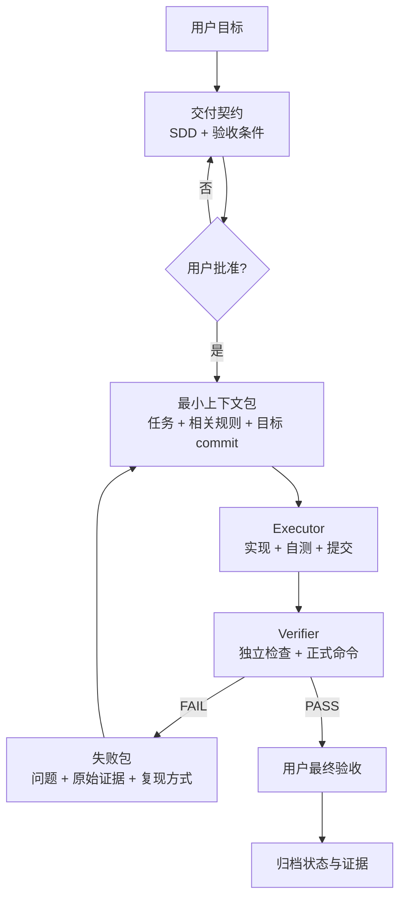
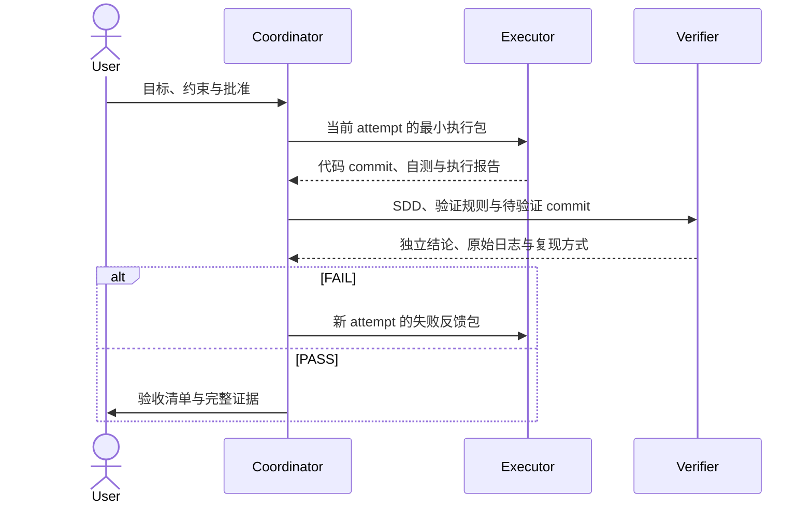

# EMI Harness

> **面向欧洲 EMI 的金融级设计到交付智能研发引擎**
>
> 把经确认的工程意图交给 Agent，同时把边界、验证和证据留在工程里。

| 当前阶段 | 当前能力 | 校准目标 |
| --- | --- | --- |
| `v0.1` 最小可运行闭环 | 仅支持 `new-module` | `emi-pilot`：8 模块 Java 工程与 `Money` 值对象 |

[阶段路线图](roadmap/README.md) · [已批准 SDD](specs/pilot/system-design.md) · [Agent 入口](AGENTS.md) · [运行索引](reports/index.md)

## 一句话定义

EMI Harness 是一个围绕 Coding Agent 构建的**受控交付环境**。它把规格、上下文、执行边界、验证工具和运行证据组织成同一条链路，使一项工作即使跨越多个 Agent、多个会话和多轮失败，也能继续执行并被独立检查。

```text
可接受的交付
= 已批准的契约
+ 有边界的执行
+ 独立的验证
+ 可追溯的证据
+ 用户的最终决定
```

它不是提示词合集，也不是法规百科，更不是让 Agent 无限制自我修改的自动化平台。

## 三个基本判断

### 1. Prompt 不是工程环境

长任务中的问题通常不是“模型不会写代码”，而是目标逐渐漂移、上下文被无关信息占满、规则只被阅读却没有执行、失败结果没有进入下一轮。可靠性不能寄托在一次提示中，必须由仓库里的契约、导航、工具和状态共同提供。

### 2. 完成声明不是交付证据

Executor 可以说明自己做了什么，但不能给自己的交付判定 PASS。验证必须针对明确的 Git commit，由独立上下文执行真实命令，并保存退出码、原始日志和逐项结论。

因此，v0.1 的评测对象是一整次 run，而不是 Agent 的一段回答：输入是否固定、角色是否隔离、门禁是否执行、失败能否回流、状态能否恢复，都属于验收内容。

### 3. 自主执行必须伴随权限边界

Agent 可以在已批准范围内自行规划、实现和修复；涉及规格、测试、规则、验收标准或重大风险判断时，必须停在人工门禁前。所谓自主，不是取消控制，而是减少边界内不必要的人工接力。

## EMI 研发中的断点

EMD2、DORA、GDPR、AML/CFT 与制裁框架不会直接变成代码。它们需要经过一条受治理的转换链：


EMI 系统的交付风险，往往出现在这些节点之间，而不是单个编码动作中。

| 常见断点 | Harness 的处理方式 |
| --- | --- |
| 监管、业务和工程知识分散在不同团队 | 先把已确认结论写入有版本、有范围的交付契约，不让 Agent 补猜缺失信息 |
| 外部义务无法稳定转换为软件控制 | 在 SDD 中明确控制目标、实现边界和可执行验收场景 |
| 关键经验只存在于少数专家脑中 | 将可复用经验拆成按需加载的 Convention、Guardrail 和 Workflow |
| 长任务跨会话后丢失进度 | 使用 `manifest.md`、attempt、报告和 commit 保存可恢复状态 |
| 实现者同时充当验收者 | 分离 Executor 与 Verifier，正式结论只接受独立验证证据 |
| 交付结束后才补审计材料 | 在执行过程中同步生成任务、日志、报告和用户决策记录 |

EMI Harness v0.1 **不负责解释法规，也不包含 EMI 监管知识库**。当前阶段验证的是：当适用要求已经获得确认后，能否把它们稳定地带入设计、实现、验证和证据链。监管知识的治理方式将在真实业务输入出现后单独设计。

## 运行闭环



每次 FAIL 都进入新的 attempt，历史证据保持只读；连续三次仍未通过则停止自动执行并升级给用户。

### 我们所说的“持续”

| 能力 | 在 EMI Harness 中的含义 | 不依赖什么 |
| --- | --- | --- |
| 持续感知 | 读取当前规格、Git 状态、任务状态和工具输出 | 不依赖 Agent 对历史对话的记忆 |
| 持续反馈 | 把失败项、退出码、日志和复现命令送入下一轮 | 不依赖一句“测试没问题” |
| 持续优化 | 从真实失败中提出规格、规则或流程改进，并经人工评审后生效 | 不允许运行中的 Agent 直接改规则让自己通过 |

v0.1 先闭合前两项，并记录第三项所需的真实缺口；暂不建设自动进化机制。

## 五个工程面

Harness 的能力不由文件数量衡量。一个文件只有在工作流中被实际加载、执行或生成，才属于有效系统。

| 工程面 | 回答的问题 | 当前载体 |
| --- | --- | --- |
| **契约** | 这次究竟交付什么，什么算完成？ | `specs/`、`templates/`、用户批准记录 |
| **上下文** | 当前角色此刻需要知道什么？ | `AGENTS.md`、`conventions/`、`harness/guardrails/` |
| **编排** | 谁在何时做什么，遇到分支如何处理？ | `skills/`、`harness/workflow/`、`harness/tools/` |
| **反馈** | 哪些结果可以客观判定，失败如何返回？ | `harness/feedback/`、独立 Verifier |
| **记忆** | 换一个 Agent 后怎样恢复，审计时怎样还原？ | run manifest、attempt 报告、原始日志和 Git commit |

这五个面共同构成 Agent 的运行环境。单独增加文档、规则或 Agent 数量，都不能替代闭环。

## 当前运行拓扑

v0.1 只保留完成闭环所必需的三个 Agent 角色。用户不是旁观者，而是规格变更和最终验收的决策边界。



| 角色 | 负责 | 无权做 |
| --- | --- | --- |
| **Coordinator** | 维护契约引用、任务、状态、门禁和角色交接 | 编写业务实现；代替 Verifier 或用户下结论 |
| **Executor** | 在当前 attempt 的批准范围内实现、自测并提交 | 修改 SDD、降低门禁；宣告正式 PASS |
| **Verifier** | 用全新上下文检查指定 commit，执行唯一正式验证并留证 | 修改实现或规则；用 Executor 的声明代替验证 |

Explore、Test、Reviewer 等角色只有在实际任务证明需要独立上下文和独立产物时才会引入，不作为“多 Agent”展示而预设。

## EMI 控制如何进入工程

外部规则进入 Harness 前，必须先完成来源、适用范围、司法辖区、版本和生效时间判断。需要法律解释或重大风险取舍的内容始终由人负责。

```text
来源
  -> 适用性判断                         [人工负责]
  -> 工程义务 / 控制目标                 [写入 SDD]
  -> 强制方式                           [工具 / 独立审查 / 人工门禁]
  -> 验收证据                           [日志 / 报告 / commit / 决策]
```

| 控制类型 | 适合的强制方式 | 示例 |
| --- | --- | --- |
| 可确定判断 | 自动化硬门禁 | 编译、金额精度测试、模块依赖、静态规则 |
| 需要语义判断 | 独立 Agent 审查并给出证据 | 业务控制是否完整、设计是否符合已批准 SDD |
| 涉及监管解释或高风险取舍 | 人工确认 | 规则是否适用、例外是否可接受、测试或验收是否允许调整 |

后续面向客户资金保护、账务一致性、数据保护、运营韧性、AML/CFT 和制裁控制的能力，都应沿这条链路进入，而不是把法规文本直接塞给 Agent。

## 当前能力边界

| 已进入 v0.1 闭环 | 尚未进入当前范围 |
| --- | --- |
| 一个 `new-module` 工作流 | `new-feature`、`refactor` 等其他任务类型 |
| Coordinator、Executor、Verifier 三角色交接 | 复杂 Agent 调度平台和预设角色集群 |
| Approved SDD 与用户门禁 | EMI 法规解释或监管知识库 |
| Maven、JUnit、Checkstyle、ArchUnit 客观验证 | 数据库、MQ、支付渠道、银行、KYC、AML 或制裁系统接入 |
| 最多三轮、证据驱动的失败回流 | Agent 自动修改 Harness 或自我进化 |
| run-id、manifest、报告、日志和 Git 追溯 | PRD 生成及其他尚未被真实试跑证明需要的能力 |

当前实现有意保持简单：文件保存状态，Skill 启动流程，Agent 执行角色职责，Maven 和 Shell 提供客观反馈。先证明闭环，再决定是否需要平台化。

## 8 模块架构

8 模块是 **`emi-pilot` 首次试跑的校准骨架**，用于检验结构约束、依赖方向和跨模块验证；它不是 EMI Harness 自身的目录结构，也不预设未来每个 EMI 系统都必须机械复制八个模块。

| 职责带 | 模块 | 首次试跑中的定位 |
| --- | --- | --- |
| 对外契约 | `{system}-client` | Facade 与 Request/Response 契约；无外部契约时不生成占位代码 |
| 应用入口 | `{system}-adapter` | REST、MQ、Scheduler 等入口按需组装 |
| 用例编排 | `{system}-app` | 应用服务、事务、幂等以及业务语义 Gateway 接口 |
| 领域规则 | `{system}-domain` | 聚合、值对象、DomainService 和 Repository 接口 |
| 技术实现 | `{system}-infra` | Repository/Gateway 实现及数据库、消息、渠道等适配 |
| 启动装配 | `{system}-start` | Spring Boot 启动入口与应用装配 |
| 最小共享 | `{system}-common` | 极少量无业务归属的基础能力，防止形成公共垃圾场 |
| 跨模块证明 | `{system}-test` | 模块结构、ArchUnit 和跨模块场景；模块单测仍留在所属模块 |

首次试跑冻结的依赖集合为：

```text
start   -> adapter, app, infra, client, domain, common
adapter -> app, common
app     -> client, domain, common
infra   -> app, domain, client, common
domain  -> common
client  -> common
test    -> 其余 7 个模块（test scope）
```

完整职责和约束见 [`conventions/module-structure.md`](conventions/module-structure.md)；首次试跑的精确依赖矩阵以 [`specs/pilot/system-design.md`](specs/pilot/system-design.md) 为准。

## 一次交付留下什么

运行证据保存在目标项目，而不是混入 Harness 规则仓库。

```text
{target-project}/reports/runs/{run-id}/
├── manifest.md                 # 当前状态、角色、attempt、commit 和下一动作
├── task-breakdown.md           # 任务、验收条件和事实进度
├── acceptance.md               # 用户的最终结论
├── retrospective.md            # 本次运行暴露的真实缺口
├── quality/                    # run 级环境与有效配置证据
└── attempts/
    └── {attempt}/
        ├── executor-report.md  # 实现范围、自测和交接事实
        ├── verifier-report.md  # 独立 PASS / FAIL 与复现方式
        └── quality/
            └── verify.log      # 正式命令的原始输出
```

`manifest.md` 是恢复运行的事实入口。新 Agent 必须从它引用的路径和 commit 恢复，不得用历史聊天记录补写状态。

以下条件缺一不可：

- 待交付范围已经写入 SDD 并获得批准。
- Executor 的变更和报告已经提交，工作区边界清楚。
- Verifier 针对指定 commit 独立执行规定命令并给出证据。
- 所有必须门禁通过，失败历史没有被覆盖或删除。
- 用户完成最终验收。

“Agent 已生成代码”不属于完成条件。

## 仓库如何分工

| 路径 | 作用 | 主要使用者 |
| --- | --- | --- |
| [`README.md`](README.md)、[`roadmap/`](roadmap/README.md) | 项目定位、边界与阶段计划 | 人 |
| [`AGENTS.md`](AGENTS.md) | 统一入口、优先级和按角色加载地图 | Coordinator 与各角色 Agent |
| [`specs/`](specs/pilot/system-design.md)、[`templates/`](templates/) | 交付契约及任务模板 | 用户、Coordinator |
| [`conventions/`](conventions/)、[`harness/guardrails/`](harness/guardrails/) | 技术基线、架构边界和不可绕过规则 | Executor、Verifier |
| [`skills/`](skills/emi-harness/SKILL.md)、[`harness/workflow/`](harness/workflow/new-module.md)、[`harness/tools/`](harness/tools/agent-tools.md) | 启动、编排和标准操作 | Coordinator |
| [`harness/feedback/`](harness/feedback/code-quality.md) | 正式验证命令、质量配置和失败判定 | Verifier |
| [`harness/observability/`](harness/observability/execution-tracing.md) | 状态机、证据字段和恢复规范 | Coordinator、Verifier |
| [`scaffolds/`](scaffolds/module-structure.md) | 经批准的生成结构 | Executor |
| [`reports/`](reports/index.md) | 跨运行索引，不复制目标项目完整证据 | 人、Coordinator |

Harness 仓库保存“如何交付”；目标业务仓库保存“本次交付了什么”。两者通过 run-id 和 Git commit 关联。

## 首次试跑

首次试跑并不是为了证明 Agent 会实现一个 `Money` 类，而是验证：一个没有历史对话的新 Agent，能否只依赖仓库中的规格、规则、工作流和反馈，完成一次可执行、可验证、可追溯、可恢复的交付。

校准任务使用 Java 17、Maven 和 Spring Boot 4.1.0，目标项目为独立的本地 `emi-pilot` 仓库。只有以下结果全部成立，v0.1 才能结束：

- 根工程和精确 8 个模块能够在固定环境中完成 Reactor 构建。
- 不可变 `Money` 的精度、运算、比较、异常和相等性契约具有实际执行的测试。
- 唯一正式 `clean verify` 命令退出码为 `0`，指定测试、Checkstyle 和 ArchUnit 均实际运行。
- FAIL 能携带原始证据进入下一 attempt，并在达到上限时停止。
- 新 Agent 可以仅根据 manifest 和提交记录恢复运行。
- 全部目标、变更、验证和决策可由同一个 run-id 追溯。
- 用户完成最终验收。

在首次闭环跑通前，不增加监管知识目录、其他工作流、外部系统接入、复杂调度或自动进化。真实运行暴露的缺口，才是下一阶段 Roadmap 的输入。

## 从这里开始

1. 阅读 [`roadmap/README.md`](roadmap/README.md)，了解当前阶段及退出条件。
2. 阅读 [`specs/pilot/system-design.md`](specs/pilot/system-design.md)，确认首次试跑的 Approved 契约。
3. 在 Harness 根目录执行安装：

   ```bash
   bash install.sh
   ```

   安装脚本记录当前 Harness 绝对路径，并将仓库内 `emi-harness` Skill 链接到本机 Codex Skill 目录。

4. Agent 从 [`AGENTS.md`](AGENTS.md) 进入，只加载当前角色所需的规则和流程。
5. 具体执行状态以目标项目的 `reports/runs/{run-id}/manifest.md` 为准。
