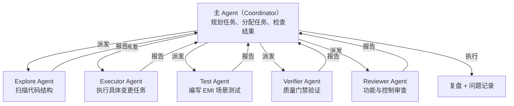
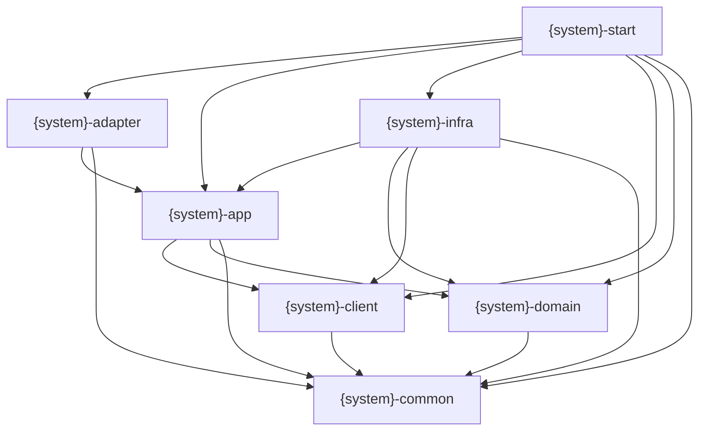
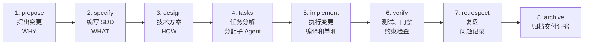
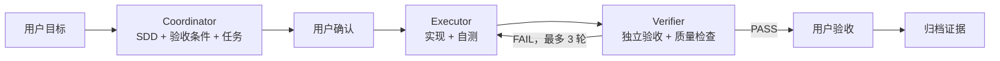

# EMI Harness｜面向欧洲 EMI 的金融级设计到交付智能研发引擎

---

## 要解决的问题

欧洲 EMI 牌照展业系统建设需要同时应对 EMD2、DORA、GDPR、AML/CFT 与制裁框架等监管要求，并落实客户资金保护、账务一致性、数据治理、运营韧性、金融犯罪防控和全链路审计等金融级工程约束。当前主要存在以下问题：

- **监管与领域知识高度分散**：相关知识分布在法务、合规、风控、安全、运营和研发团队，并受到司法辖区、业务模式、规则版本和生效时间等条件影响，难以形成统一、准确且持续更新的知识体系。

- **监管义务难以工程化落地**：外部监管要求需要经过适用性判断、内部政策解释和业务控制设计，才能转化为软件规格、架构约束、代码配置和测试标准。这条转换链路依赖大量人工理解，容易出现遗漏、歧义和实现偏差。

- **系统交付依赖少数专家**：需求澄清、方案设计和合规审查高度依赖具备 EMI 业务与金融工程经验的资深人员，导致培养周期长、交付效率低，专家也容易成为多项目并行时的瓶颈。

- **交付质量缺乏稳定性**：不同团队对同一监管要求和业务规则可能产生不同理解，金额、账务、状态、权限、数据处理、韧性和金融犯罪防控等关键控制容易在研发过程中被弱化或遗漏。

- **缺少端到端追溯与交付证据**：监管义务、内部政策、业务控制、系统规格、代码实现、测试结果和运行证据之间缺少稳定的关联，系统即使完成交付，也难以快速证明“满足了什么要求、由什么控制实现、经过了什么验证”。

- **规则变化难以持续传导**：法规、监管解释、内部政策、审计发现和生产事故发生变化后，影响范围难以及时识别，相关规格、代码、测试和控制无法形成一致、受控的更新闭环。

- **通用 AI Agent 无法直接满足 EMI 研发要求**：通用 Agent 缺少经过治理的权威知识、明确的适用边界、金融级工程约束和独立验证机制，可能放大过期规则、错误解释和无证据结论，无法稳定完成 EMI 系统从设计到交付的可靠性、合规性与可审计性要求。

## 解决方案

把 EMI 系统研发所需的监管规则、业务规范、架构约束和质量检查沉淀到 Harness 中。先通过 SDD 明确业务需求、监管要求和验收标准，再由 AI Agent 按统一流程完成设计、编码和测试，并通过自动化检查与人工审查验证结果。每次交付保留需求、设计、代码变更、测试结果和审查记录，便于追溯问题和持续更新规则。

```text
SDD（规格）      → 定义「做什么」
Harness（约束）  → 规定「怎么做、怎么检查」
交付记录          → 说明「做了什么、是否通过」
```

## 核心理念

### Spec Driven Development（规格驱动开发）

**核心原则**：在 Agent 开始实现前，先明确本次交付的范围、关键规则和验收方式；未确认的问题必须显式记录，不允许 Agent 自行猜测。

- **按风险确定规格深度**：高风险或跨系统变更需要完整 SDD；低风险局部改动可以使用精简规格。
- **要求来源可追溯**：关键设计应关联到业务需求、经过确认的监管要求或内部政策。
- **要求结果可验证**：每项关键要求都应有对应的验收场景、测试或人工检查方式。
- **保持同步变更**：需求、规格、代码和测试应在同一次变更中保持一致。

### Harness Engineering（约束工程）

**核心原则**：把适用于当前任务的关键规则放入 Agent 的执行流程，并为每条关键规则明确检查方式。只有实际参与检查或门禁的规则，才构成有效约束。

- **按适用范围加载**：根据国家、业务、系统、任务类型和规则版本加载必要约束，避免无关规则干扰执行。
- **按执行方式分级**：可确定判断的规则由工具强制检查；需要语义判断的规则由独立 Agent 审查；涉及监管解释或重大风险的事项由人工确认。
- **硬门禁独立执行**：关键检查应由 CI、测试、权限控制或专用工具执行，不能依赖执行 Agent 自觉遵守。
- **失败必须闭环**：检查失败后返回明确原因，修复后重新验证；超过重试次数或无法判断时升级给人。
- **规则受控更新**：执行过程中可以提出规则改进建议，但必须经过评审和验证后才能生效。
- **验证后才能交付**：Agent 完成代码不代表任务完成。只有 SDD 约定的测试、质量检查和必要的人工审查全部通过后，才能交付；未通过则返回修复。

## 多 Agent 协作架构

### 设计原则

EMI 系统代码量大，业务与监管规则复杂，单一 Agent 执行容易导致上下文超载。EMI Harness 采用 **主 Agent + 多子 Agent** 分工协作：



### 职责分离

| 角色 | 职责 | 加载的上下文 |
|------|------|-------------|
| **Coordinator（主 Agent）** | 规划任务、分配子 Agent、检查执行结果、组织复盘 | 项目导航 + SDD + 任务清单 |
| **Explore Agent** | 扫描源码结构、提取领域模型 | 当前任务涉及的源码文件 |
| **Executor Agent** | 执行具体变更任务 | 当前变更任务 + 对应约束 |
| **Test Agent** | 编写 EMI 业务与合规场景测试 | SDD 验收标准 + 测试清单 + 被测代码 |
| **Verifier Agent** | 运行质量门禁和约束检查 | 质量规则 + 约束规则 + 全量变更 |
| **Reviewer Agent** | 检查功能、业务控制及重构前后的一致性 | SDD + 原有实现基线 + 变更后代码 |

### 上下文管理

- **每个子 Agent 执行完即释放上下文**，不累积无关历史。
- **主 Agent 只保留 SDD、任务清单、项目导航和子 Agent 报告**，不加载全部源码。
- **子 Agent 只加载当前任务涉及的文件和对应约束**，避免无关信息干扰执行。
- **通过 SDD、任务清单、报告和执行日志传递信息**，不依赖 Agent 之间共享对话上下文。

## 8 模块架构

EMI Harness 生成或改造的每个业务系统，统一采用与现有技术栈一致的 8 模块 Maven 工程结构。`{system}` 表示具体业务系统名称。

| 模块 | 职责 |
|------|------|
| **`{system}-client`** | 对外契约：Facade 接口和 Request/Response DTO，可独立发布给其他系统依赖，不包含实现代码。 |
| **`{system}-adapter`** | 应用入口聚合器，按需提供 REST Controller、MQ Consumer 和 Scheduler。 |
| **`{system}-app`** | 应用编排：Facade 实现、AppService、事务、幂等、Command/Result、转换器以及业务语义 Gateway 接口。 |
| **`{system}-domain`** | 领域模型与领域规则：聚合根、状态机、DomainService、Repository 接口以及领域数据载体。具体承载账户、支付、账务、资金保护等当前系统的业务规则。 |
| **`{system}-infra`** | 基础设施实现：Repository/Gateway 实现、Mapper、PO、数据库、MQ、Redis、ID 生成，以及银行、支付渠道、KYC、AML 和制裁筛查等外部系统接入。 |
| **`{system}-start`** | DongBoot 启动入口和应用装配。 |
| **`{system}-common`** | 极少量通用基础能力；业务 DTO、Repository、Gateway、枚举和常量不得放入该模块。 |
| **`{system}-test`** | 跨模块集成测试、ArchUnit 架构约束测试，以及 EMI 关键业务与合规场景测试；模块内单元测试仍放在各自模块。 |

### 依赖方向



### 核心约束

- `domain` 不依赖 `infra`，Repository 接口定义在 `domain`，实现在 `infra`。
- `app` 不依赖 `infra`，业务语义 Gateway 接口定义在 `app`，实现在 `infra`。
- `adapter` 只通过 `app` 访问业务能力，不直接访问 `domain` 或 `infra`。
- `client` 只保存对外契约，不包含业务实现。
- `common` 保持最小化，不能成为跨层依赖的业务代码堆放区。

## 核心工作流



| 步骤 | 执行者 | 输入 | 输出 |
|------|--------|------|------|
| **propose** | 用户 / Coordinator | 业务需求、监管要求、内部政策、审计发现或生产问题 | 说明变更原因、目标和初步范围的变更提案 |
| **specify** | Coordinator | 变更提案 + 规格模板 | 明确范围、业务规则、适用约束和验收标准的 SDD |
| **design** | Coordinator | 已确认的 SDD | 写入 SDD 的领域模型、接口、数据、异常处理和技术方案 |
| **tasks** | Coordinator | SDD + 技术方案 | 范围明确、可独立验证的任务清单及子 Agent 分工 |
| **implement** | Executor Agent | 单个变更任务 + 对应约束 | 代码变更、编译结果和相关单元测试结果 |
| **verify** | Verifier Agent + Test Agent | 全量变更 + SDD 验收标准 + 约束规则 | `mvn verify`、架构与反模式检查、EMI 场景测试及验证报告 |
| **retrospect** | Coordinator，用户确认 | 执行日志 + 验证报告 | 规格、规则、测试和执行过程的复盘报告及问题记录 |
| **archive** | Coordinator | SDD + 任务记录 + 交付证据 + 复盘报告 | 归档到业务项目的完整交付记录 |

### 关键门禁

| 门禁 | 阶段 | 未通过处理 |
|------|------|-----------|
| 需求与验收标准确认 | specify / design | 未确认的问题记录在 SDD 中，不进入实现 |
| `mvn compile` + 相关单元测试 | 每个 implement 任务完成后 | 返回 Executor 修复并重新执行 |
| `mvn verify` | verify | 修复后重新验证；超过重试次数则升级给人 |
| 架构、反模式和关键约束检查 | verify | 必须消除本次变更新增的 MUST 违规 |
| EMI 业务与合规场景测试 | verify | 修复实现或补充规格后重新验证 |
| 最终交付确认 | archive 前 | 所有要求的检查和人工审查通过后才能归档交付 |

交付证据保存在对应业务项目中。复盘只记录本次执行中发现的问题，不自动生成或应用 Harness 改进；确需调整 Harness 时，作为普通变更单独提出并经过人工评审。

## 框架结构

第一阶段只建设一个可运行的最小闭环：支持一个 `new-module` 任务，由 Coordinator、Executor 和 Verifier 三个角色完成规划、执行、独立验证与失败回流。目录中的每个文件都必须被该闭环实际读取或生成；未进入首次运行链路的能力不提前建设。

### 最小运行闭环



- **Coordinator** 只管理目标、SDD、任务、运行状态和角色交接，不直接实现业务代码。
- **Executor** 只获取当前任务、相关 SDD 和必要 Guardrail，完成代码与自测。
- **Verifier** 使用全新上下文，基于 SDD 验收条件和客观命令独立判定，不依赖 Executor 的实现思路或完成声明。
- 验证失败时，Verifier 必须输出失败项、证据和复现方式；Coordinator 将该报告交回 Executor。
- 连续三轮仍未达到验收条件时停止自动执行，记录当前状态并升级给用户。

### 最小目录树

```text
emi-harness/
├── README.md
├── AGENTS.md                       # Agent 导航入口和按需加载地图
├── install.sh                      # 记录 Harness 路径并安装 Skill
│
├── roadmap/
│   └── README.md                    # 阶段目标、实施计划和当前进度
│
├── specs/
│   └── pilot/
│       └── system-design.md          # 首次试跑的 SDD 与验收条件
│
├── conventions/
│   ├── tech-stack.md                 # 首次试跑使用的已确认技术栈
│   └── module-structure.md           # 8 模块职责与依赖方向
│
├── harness/
│   ├── guardrails/
│   │   ├── core-must-rules.md        # 首个闭环必须遵守的最小规则集
│   │   ├── architecture.md           # 8 模块架构约束
│   │   ├── domain-modeling.md        # Money 和领域对象约束
│   │   └── code-style.md             # 首次试跑需要的代码规范
│   ├── feedback/
│   │   ├── code-quality.md           # 唯一验证命令、通过标准和失败处理
│   │   ├── maven/                    # Maven 质量插件配置
│   │   ├── checkstyle/               # 最小 Checkstyle 规则
│   │   └── archunit/                 # 8 模块依赖测试模板
│   ├── tools/
│   │   └── agent-tools.md            # 创建 SDD、生成骨架、执行验证和记录证据
│   ├── workflow/
│   │   └── new-module.md             # 首个闭环的单一工作流
│   └── observability/
│       └── execution-tracing.md       # run-id、阶段、轮次、交接和结果记录
│
├── templates/
│   ├── sdd-template.md                # 最小 SDD 模板
│   └── task-breakdown-template.md     # 任务、验收条件和进度模板
│
├── scaffolds/
│   └── module-structure.md            # 可编译的 8 模块 Maven 骨架
│
├── skills/
│   └── emi-harness/
│       └── SKILL.md                   # 读取路径并启动 new-module Workflow
│
└── reports/
    └── index.md                       # 首次及后续执行的全局索引
```

### 运行状态与证据

Agent 的完成声明不作为运行状态。Coordinator 必须将状态、交接和原始验证证据写入目标项目，使任务可以在新上下文中继续执行。

```text
{target-project}/reports/runs/{run-id}/
├── manifest.md                  # 目标、当前阶段、尝试轮次、交接和最终状态
├── task-breakdown.md            # 当前任务、验收条件和完成证据
├── executor-report.md            # Executor 变更摘要与自测结果
├── verifier-report.md            # Verifier 逐项 PASS/FAIL 结论与复现方式
└── quality/
    └── verify.log                # 原始验证命令输出
```

### 首次试跑

首个目标是创建一个最小 8 模块 Java 17 Maven 工程，并实现不可变 `Money` 值对象及单元测试。本次运行只有在以下条件全部满足时才能完成：

- 8 个 Maven 模块可由根工程统一编译。
- `Money` 的不可变性、同币种运算和异币种拒绝具有单元测试。
- `mvn verify` 返回成功，Checkstyle 和 ArchUnit 检查通过。
- `manifest.md`、Verifier 报告和原始验证日志完整，且可以相互追溯。
- 用户完成最终验收。

在这个闭环实际跑通前，不增加 `new-feature`、`refactor`、分层 Skill、监管知识目录、PRD 生成、外部接入或 Harness 自我进化机制。首次运行暴露的真实缺口，作为后续目录和能力扩展的依据。
